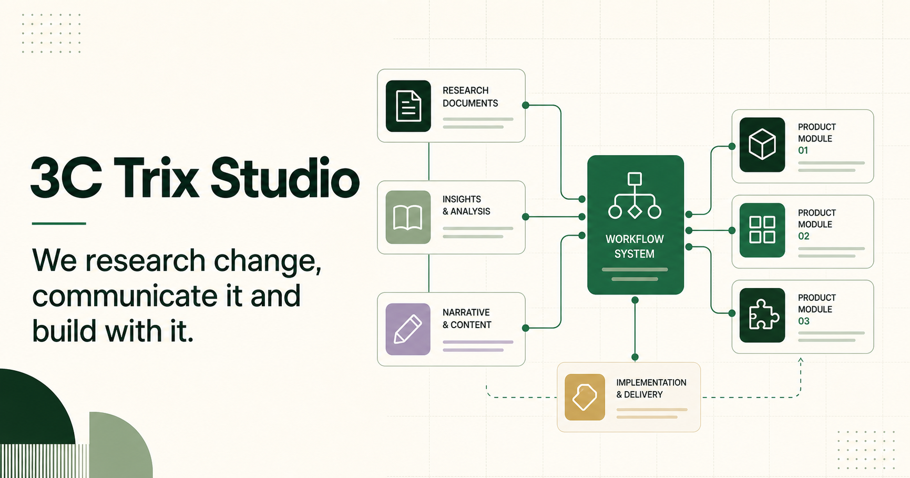

# 3C Trix Studio

The production website for **3C Trix Studio**, a research, AI automation and web-design studio founded by Beatriz Pereira Ferreira.

[Visit 3ctrix.com](https://3ctrix.com) · [Research](https://3ctrix.com/research) · [AI automations](https://3ctrix.com/automations) · [Websites](https://3ctrix.com/websites)



## What this project demonstrates

This is a multi-service company website built as one cohesive Next.js application. Each area has its own narrative, visual system and conversion path while sharing typography, navigation, accessibility standards, contact infrastructure and deployment configuration.

- `/` — studio homepage and service overview
- `/research` — AI research, analysis and content portfolio
- `/automations` — AI automation and implementation services
- `/websites` — website creation and redesign, in Portuguese
- `/websites/en` — English version of the websites service
- `/politica-de-privacidade` — privacy policy
- `/termos-e-condicoes` — terms and conditions

## Highlights

- Responsive editorial layouts for desktop and mobile
- Motion and interactive storytelling with Framer Motion, GSAP and Three.js
- Reusable, typed content architecture
- Bilingual website-services experience
- Server-side contact forms with validation and anti-spam controls
- Separate routing of general, research, automation and website enquiries
- Cloudflare Workers deployment through OpenNext
- SEO metadata, Open Graph assets, sitemap and legal pages
- Portfolio case studies with verified project imagery

## Technology

| Layer | Technology |
| --- | --- |
| Application | Next.js App Router, React, TypeScript |
| Styling | Tailwind CSS and project-specific CSS |
| Motion | Framer Motion, GSAP and Three.js |
| Icons | Lucide React |
| Hosting | Cloudflare Workers via OpenNext |
| Forms | Server-side route handlers and Resend |
| Quality | ESLint, TypeScript and production builds |

## Project structure

```text
src/
  app/                 Routes, layouts, metadata and server handlers
  components/          Shared interface and visual components
  config/              Public site and contact configuration
  content/             Typed copy and portfolio content
public/                Brand, photography and Open Graph assets
open-next.config.ts    Cloudflare/OpenNext adapter configuration
wrangler.jsonc         Worker routes and public deployment settings
```

The principal content files are:

- `src/content/home.ts` — homepage
- `src/content/automations.ts` — automation services
- `src/content/research.ts` — research narrative
- `src/content/researchProjects.ts` — research portfolio
- `src/config/site.ts` — public contact and brand configuration

## Run locally

Requirements: Node.js 20 or later.

```bash
npm install
npm run dev
```

Open <http://localhost:3000>.

## Environment configuration

Copy `.env.example` to `.env.local` and provide only the variables required by the features being tested. Server-side secrets must never use a `NEXT_PUBLIC_` prefix.

Server-side contact variables:

```text
RESEND_API_KEY
CONTACT_TO_EMAIL
WEBSITES_CONTACT_TO_EMAIL
CONTACT_FROM_EMAIL
```

Optional public configuration:

```text
NEXT_PUBLIC_SITE_URL
NEXT_PUBLIC_CONTACT_EMAIL
NEXT_PUBLIC_CONTACT_PHONE
NEXT_PUBLIC_WHATSAPP_NUMBER
NEXT_PUBLIC_LINKEDIN_URL
```

## Validate

```bash
npm run lint
npx tsc --noEmit
npm run build
```

## Deploy to Cloudflare

Authenticate Wrangler, configure the server-side secrets in the Worker environment and run:

```bash
npm run deploy
```

The Worker routes cover `3ctrix.com` and its subpages. Do not commit `.env.local`, Wrangler authentication data or generated build directories.

## Design and content principles

- Show real work and verified project imagery.
- Keep every service understandable without technical jargon.
- Use motion to support the story, not to obstruct it.
- Keep contact routes short and explicit.
- Preserve accessible contrast, keyboard navigation and reduced-motion behaviour.
- Never fabricate client logos, testimonials or performance claims.

## Author

Designed and developed for **3C Trix Studio** by Beatriz Pereira Ferreira, with Codex used as an implementation and validation partner.
